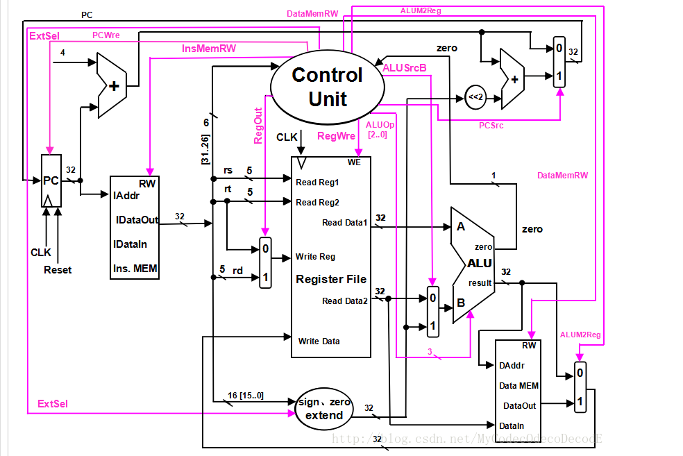

# Simple_CPU
CPU By Verlilog  
这是计算机组成原理的期末课程设计作业

## 设计一个单周期CPU  

- 设计完成一个能够以单周期的方式处理任务（即指令功能操作）的CPU程序
- 要求所使用语言为Verlilog


要求能够实现以下指令功能操作，需设计的指令与格式如下
```
    算术运算指令
    1. add rd,rs,rt
    2. addi rt,rs,immediate
    3, sub rd,rs,rt
    ---
    逻辑运算指令
    1. ori rt，rs，immediate
    2. and rd，rs，rt
    3. or rd，rs，rt
    ---
    传送指令
    1. move rd，rs
    ---
    存储器读/写指令
    1.sw rt，immediate（rs）
    2.lw rt，immediate（rs）
    ---
    分支指令
    beq rs，rt，immediate
    ---
    停机指令
    halt
    功能：停机，不改变PC的值，即为PC值保持不变
```
单周期的CPU数据通路如下图所示  


